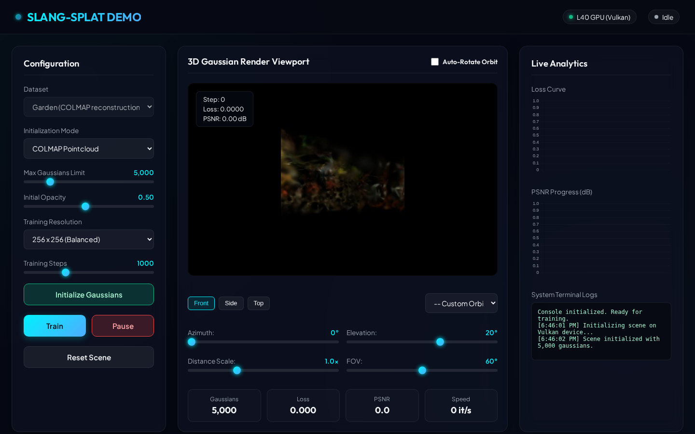
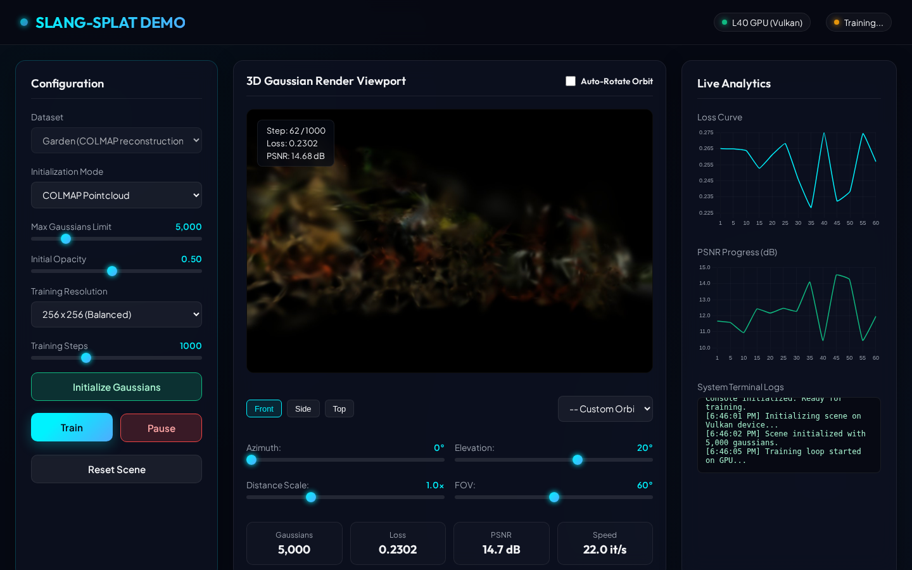
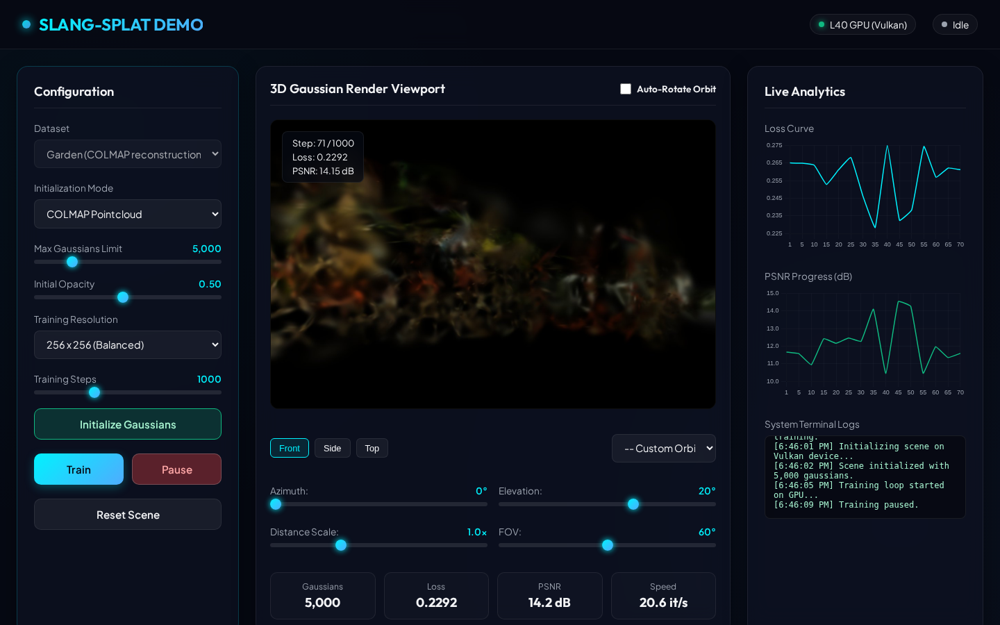
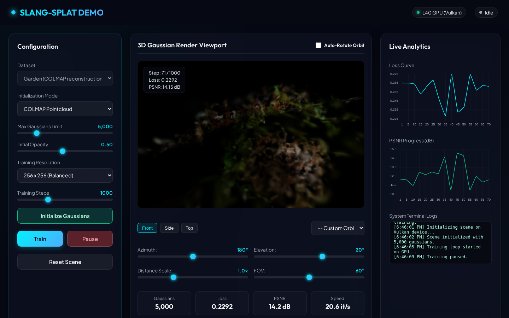
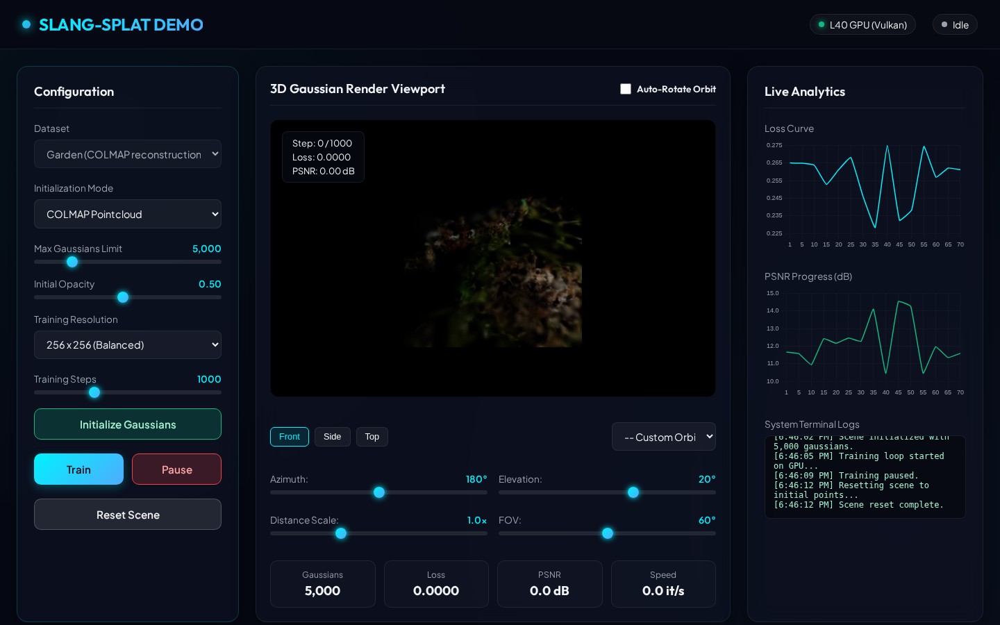

# Slang-Splat Web Demo Stack

This repository orchestrates a Dockerized interactive web demonstration of **Slang-Splat**—a Vulkan compute-based 3D Gaussian Splatting engine running on PyTorch/Slang/Slangpy. 

The parent repository manages the orchestration stack, environment configuration, and entrypoint scripts, pulling the core engine code and wrapper utilities from submodules.

## 📋 Prerequisites

To run this application, the host machine must support:
- **Docker** and **Docker Compose**
- **NVIDIA Driver** (supporting CUDA/Vulkan)
- **NVIDIA Container Toolkit** (configured with the `nvidia` runtime for Docker)

## 🚀 Quick Start Guide

The repository includes a set of automated shell scripts at the root level to manage the container lifecycle.

| Action | Command | Purpose |
|--------|---------|---------|
| **Install** | `./install.sh` | Builds the web application Docker image. |
| **Start** | `./start.sh` | Launches the FastAPI web server container in the background. |
| **Stop** | `./stop.sh` | Stops the running container and cleans up the Docker network. |
| **Monitor** | `./monitor.sh` | Attaches to the container's logs for stdout/stderr tracking. |
| **Restart** | `./restart.sh` | Restarts the containers (executes `stop` followed by `start`). |

## ⚙️ Configuration

The port mapping is configured via the `.env` file at the root:
```env
PORT=3071
```
Modify this variable to map the web interface to any other host port.

Once started, navigate to your host browser at `http://localhost:<PORT>` (default: `http://localhost:3071`) to access the interface.

## 🎨 Interactive Web Features

The premium web application dashboard provides:
1. **Interactive Render Viewport**: A canvas updating in real-time. Sliders control the camera's Orbit angles (Azimuth, Elevation, Distance Scale, and FOV) to view the scene from any direction.
2. **Auto-Rotate Mode**: Keeps the orbit camera rotating around the scene in the background, updating the canvas continuously.
3. **Training Coordinator**: Live training controls ("Train", "Pause", "Reset Scene") mapped directly to the Vulkan-backed PyTorch engine.
4. **Live Analytics**: Real-time line graphs showing step-by-step progress of **Training Loss** and **PSNR (dB)**.
5. **View Presets & Camera Selects**: Instant switching between Front, Side, and Top views, or selecting from actual COLMAP dataset camera frames.
6. **Initialization Configs**: Adjust initial opacity, initialization pointcloud mode (COLMAP or Diffused), and training resolution constraints dynamically.

## 📸 Screenshots & E2E Verification

Features are verified automatically using [run_e2e_test.py](file:///home/aiserver/LABS/DIGITAL-TWIN-3D/slang-splat-demo-jul-2026/run_e2e_test.py) (via Playwright). The verification snapshots are embedded below:

### 01 Before Training Start
Shows the dashboard with default pre-initialized scene rendering and 0 training steps.


### 02 After Training Start
Shows active training state, descending loss, and ascending PSNR analytics.


### 03 After Training Pause
Verifies training pause behavior and stats preservation.


### 04 After Camera Orbit
Verifies custom orbit rotation viewpoint rendering.


### 05 After Scene Reset
Confirms parameters and trained Gaussians reset to initial state.


## 📂 Project Structure

- `main.py` - FastAPI backend wrapping the slang-splat library in a thread-safe training loop.
- `index.html` - Dashboard interface built with clean HTML5, Javascript, CSS variables, and Chart.js.
- `Dockerfile` - Container definition using OpenGL-GLVND runtime base and `uv` package sync.
- `docker-compose.yml` - Resource reservations and port mappings.
- `slang-splat/` - (Submodule) Slangpy compute shader source code, projection math, radix sort, and trainer implementation.
- `demo-wrapper-only/` - (Submodule) Parent metadata configuration.
- `screenshots/` - End-to-end automated validation captures.